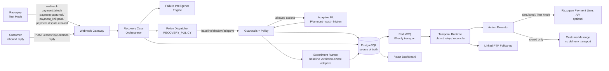
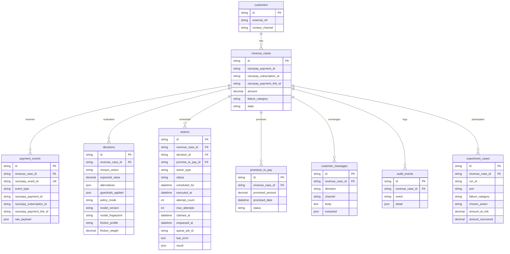

# RecoveryOS — Architecture

> Canonical system design. For "what is done **right now**" see `docs/CURRENT_STATE.md`. States, flows, and contracts here are derived from `backend/app/**` — if this document drifts from code, code wins and this document must be fixed.

## One-line pitch

When a Razorpay payment fails, RecoveryOS decides whether to wait for a native retry, contact the customer, send a payment link, collect a promise-to-pay, escalate — or do nothing — and measures which decisions recover the most money with the least customer friction.

## Product boundary

Razorpay Optimizer already decides **which gateway/route** should process a payment attempt. RecoveryOS starts **after** a payment has already failed or a receivable has gone overdue. It answers: *what should the business do next?* It does not touch routing.

| Capability | Razorpay already has | What RecoveryOS adds |
|------------|----------------------|----------------------|
| Payment / subscription failure events | Yes | Consumes them as recovery signals |
| Automatic subscription retries | Yes | Decides whether to stay silent while a native retry runs (`WAIT_FOR_NATIVE_RETRY`) |
| Payment Links | Yes | Decides *when* creating one is the right move |
| Gateway routing optimization | Yes (Optimizer / Smart Router) | Out of scope |
| Failure metadata (`error_source`/`step`/`reason`) | Yes | Normalizes it into 8 explicit recovery categories |
| Promise-to-pay | Suggested in brief | One action inside a larger decision controller, not the whole product |
| Stopping rules / audit trail | Required by brief | Executable, persisted, downloadable |
| Cross-intervention decisioning (wait vs contact vs link vs PTP vs escalate) | Not a standalone offering | Central policy layer of this project |

---

## System context



---

## Components and status

| Component | Status | Responsibility | Provider calls? |
|-----------|--------|---------------|-----------------|
| Webhook Gateway `app/routers/webhooks.py` | [IMPLEMENTED] | Verify `x-razorpay-signature` on raw bytes, require `x-razorpay-event-id`, dedupe via unique constraint, persist `PaymentEvent` | No |
| Failure Intelligence `app/services/failure_diagnosis.py` | [IMPLEMENTED] | Map (`error_source`,`error_step`,`error_reason`, subscription context) → 8 categories | No |
| Recovery Case Orchestrator `app/services/orchestrator.py` | [IMPLEMENTED] | Owns every `RevenueCase.state` mutation; routes events to diagnosis/policy/recovery/dispute/PTP | No directly — delegates |
| Guardrail Engine `app/services/policy_engine.py` | [IMPLEMENTED] | Enforce `max_contacts_per_case`, `max_contacts_per_7_days`, `min_contact_interval_hours`, `max_automated_amount`, `max_total_attempts` | No |
| Baseline Policy `app/services/policy_engine.py:decide` | [IMPLEMENTED] | Pick highest-ranked allowed action for the category (deterministic) | No |
| Policy Dispatcher `app/services/policy_dispatcher.py` | [IMPLEMENTED] | Routes `RECOVERY_POLICY=baseline/shadow/adaptive` to correct engine; shadow audits without side effect; adaptive falls back to baseline | No |
| Adaptive ML Policy `app/services/ml_policy.py:decide_ml` | [IMPLEMENTED · LIVE] | Friction-aware `P*amount - cost - friction_weight*friction`; shares guardrails; provenance + manifest fingerprint | No — model inference locally; `Razorpay` never called directly |
| Temporal Runtime `app/services/temporal_runtime.py` | [IMPLEMENTED · VERIFIED] | Atomic action claims, wait wake-up, bounded retry, stale-job checks, lease recovery, reconciliation | Delegates provider calls after claim commit |
| RQ Transport `app/services/task_queue.py`, `app/jobs.py` | [IMPLEMENTED · VERIFIED] | Publish ID-only immediate/delayed jobs after DB commit; Redis is reconstructable | Redis only |
| Action Executor `app/services/action_executor.py` | [IMPLEMENTED · VERIFIED] | Perform provider calls outside DB transactions and persist final results | Razorpay (Payment Links) and LLM (draft) when enabled |
| Razorpay Client `app/services/razorpay_client.py` | [IMPLEMENTED · SIMULATED / TEST_MODE_ONLY] | `POST /v1/payment_links`; simulation fallback; `rzp_test_*` gate | Yes — Razorpay Test Mode when `RAZORPAY_API_ENABLED=true` |
| LLM Client `app/services/llm_client.py` | [IMPLEMENTED · OPTIONAL LLM] | Draft outbound text (DRAFT with `[[PAYMENT_LINK]]` placeholder) and structured PTP extraction `{intent, promised_amount, promised_date, confidence, reasoning_code}` — typed errors, prompt versioning, bounded retries, PII-minimized | Yes — Anthropic (`https://api.anthropic.com/v1/messages`, `x-api-key`) or OpenCode Zen (`https://opencode.ai/zen/v1/responses`, `Authorization: Bearer`, `muse-spark-1.2-contributor-free`, Responses API `output[].content[].text`/`output_text`) when `LLM_API_ENABLED=true` + sub-gates; other providers raise; `LLM_API_ENABLED=false` → deterministic fallback |
| PTP Extractor `app/services/ptp_extractor.py` | [IMPLEMENTED · VERIFIED] | Deterministic validation of structured extraction before recording `PromiseToPay` (intent, date range, amount ≤ outstanding, amount_method=customer_explicit, confidence, case eligible) | No |
| PTP Follow-up `app/services/ptp_followup.py` | [IMPLEMENTED · VERIFIED] | Resolve the exact linked promise after its merchant-local due day | No |
| Windows Worker `app/worker.py` | [IMPLEMENTED · VERIFIED] | RQ `SimpleWorker` with timer timeout, avoiding unsupported fork/SIGALRM | Redis/PostgreSQL |
| Experiment Runner `app/services/experiment_runner.py` | [IMPLEMENTED] | Matched-scenario baseline vs adaptive with `run_id` + CSV audit | No |
| Dashboard `frontend/src/**` | [IMPLEMENTED] | Health, case list, case detail, decision inspection, timeline, provider status, and experiment panel | No |

Money-moving decisions are made by deterministic code (guardrails + policy), never by an LLM.

---

## Event flow

```mermaid
sequenceDiagram
    participant RZP as Razorpay
    participant GW as Webhook Gateway
    participant DB as PostgreSQL
    participant ORCH as Orchestrator
    participant DIAG as Failure Diagnosis
    participant POL as Policy + Guardrails
    participant RQ as Redis/RQ
    participant WORKER as Temporal Worker
    participant EXEC as Action Executor

    RZP->>GW: POST /webhooks/razorpay<br/>(event, payload, x-razorpay-signature, x-razorpay-event-id)
    GW->>GW: verify_signature(raw_body, secret)
    GW->>DB: INSERT PaymentEvent (unique event_id)
    alt duplicate event_id
        DB-->>GW: IntegrityError
        GW-->>RZP: 200 {ignored: duplicate_event}
    end
    GW->>ORCH: handle_event(db, event, payload)
    ORCH->>DIAG: classify_failure(entity)
    DIAG-->>ORCH: failure_category
    ORCH->>POL: decide(case) — baseline, inline
    POL->>DB: INSERT Decision + Action (SCHEDULED), set case.state
    ORCH->>DB: COMMIT
    GW->>RQ: enqueue(action_id) after commit
    GW-->>RZP: 200 {case_id, case_state}
    RQ->>WORKER: app.jobs.process_action(action_id)
    WORKER->>DB: lock case; conditional SCHEDULED → EXECUTING; COMMIT
    alt provider action
        WORKER->>EXEC: perform(snapshot), no DB transaction
        EXEC-->>WORKER: result / expected failure
    else WAIT / PTP
        WORKER->>WORKER: deterministic temporal transition
    end
    WORKER->>DB: re-lock; finalize / retry / stale no-op; COMMIT
```

---

## State ownership

- State mutation is limited to owning services: orchestrator for inbound events/replies, policy engine for decision outcomes, and temporal runtime/action executor/PTP follow-up for claimed worker transitions. Routers, queue transport, and ML code do not mutate case state.

---

## Recovery case state machine — canonical definition

Derived from `app/services/orchestrator.py:46` and `app/services/policy_engine.py:41`.

```mermaid
stateDiagram-v2
    [*] --> DETECTED : payment.failed creates case
    DETECTED --> DIAGNOSED : classify_failure
    DIAGNOSED --> DECISION_READY : guardrail check begins (ephemeral)
    DECISION_READY --> WAITING : WAIT / WAIT_FOR_NATIVE_RETRY
    DECISION_READY --> ACTION_SCHEDULED : CREATE_PAYMENT_LINK / CONTACT_CUSTOMER / COLLECT_PROMISE_TO_PAY
    DECISION_READY --> HUMAN_REVIEW : ESCALATE / failed execution / unclear PTP
    DECISION_READY --> STOPPED : STOP (max_total_attempts)
    ACTION_SCHEDULED --> AWAITING_OUTCOME : executor marks EXECUTED\n(payment link / drafted message)
    ACTION_SCHEDULED --> HUMAN_REVIEW : executor marks FAILED
    AWAITING_OUTCOME --> RECOVERED : payment.captured / payment_link.paid
    WAITING --> RECOVERED : payment.captured / payment_link.paid
    HUMAN_REVIEW --> RECOVERED : payment.captured / payment_link.paid
    ACTION_SCHEDULED --> RECOVERED : late capture (any pre-terminal except DISPUTED)
    AWAITING_OUTCOME --> DISPUTED : payment.dispute.created / customer dispute reply
    WAITING --> DISPUTED : dispute
    HUMAN_REVIEW --> DISPUTED : dispute
    RECOVERED --> DISPUTED : dispute overrides recovery (chargeback after capture)
    AWAITING_OUTCOME --> AWAITING_OUTCOME : customer promise_to_pay\n(recorded + FOLLOW_UP_PTP scheduled)
    WAITING --> DIAGNOSED : due WAIT worker re-evaluates
    AWAITING_OUTCOME --> HUMAN_REVIEW : due linked FOLLOW_UP_PTP — BROKEN promise
    STOPPED --> RECOVERED : legitimate late recovery event

    note right of WAITING : RQ delayed wake-up;\nPostgreSQL action is authoritative
    note right of AWAITING_OUTCOME : webhook / reply / linked PTP deadline
    RECOVERED --> [*]
    STOPPED --> [*]
    DISPUTED --> [*]
```



### State inventory

| State | Terminal? | How entered | In `REPLYABLE_STATES`? | Notes |
|-------|-----------|-------------|------------------------|-------|
| `DETECTED` | No | `_handle_failure` creates `RevenueCase` | No | Immediately diagnosed within same request |
| `DIAGNOSED` | No | `_diagnose` sets `failure_category` + `state=DIAGNOSED` | Yes — but only ephemeral | Immediately passed to `policy_engine.decide` |
| `DECISION_READY` | No | `policy_engine.decide` sets before choosing | Yes | Never persisted long — transitions inline to a final state |
| `WAITING` | No | `WAIT` / `WAIT_FOR_NATIVE_RETRY` | Yes | Worker wakes at `scheduled_for`; recovery/dispute may arrive first |
| `ACTION_SCHEDULED` | No | `CREATE_PAYMENT_LINK` / contact action before execution | Yes | Worker claim leads to outcome, retry, or human review |
| `AWAITING_OUTCOME` | No when linked PTP exists | Action executed or PTP recorded | Yes | Webhook/reply/PTP deadline can transition it |
| `HUMAN_REVIEW` | Automation-terminal | `ESCALATE`, exhausted execution, invalid/broken PTP | Yes | Legitimate recovery remains possible |
| `RECOVERED` | **Yes** | `_recover_case` (late capture or `payment_link.paid`) | No | Dispute still overrides to `DISPUTED` |
| `STOPPED` | **Yes** | `STOP` (stopping rule) | No | `RECOVERED` still possible via inbound recovery event; dispute can override |
| `DISPUTED` | **Yes** | `_dispute_case` | No | Always wins, even over `RECOVERED` |

### Known deviation between intended and actual transitions

- `REPLYABLE_STATES` (`orchestrator.py:294`) includes `DECISION_READY`. Since `DECISION_READY` is never persisted beyond the current transaction, this branch is effectively dead. Harmless but documented in `docs/CURRENT_STATE.md` debt.
- `WAIT` and `WAIT_FOR_NATIVE_RETRY` share execution logic but use independently configurable delays. A completed wait is blocked from repeating so re-evaluation progresses conservatively.

---

## Database as source of truth



- `payment_events`, `decisions`, `audit_events` are **append-only** — never overwritten. The history is itself the product.
- Migrations own schema (`backend/alembic/versions/*`); `app/models.py` is the source of truth for model shape.
- For the full column list, read `app/models.py:29`.

### Durable action protocol

1. Request transaction persists the event, case, decision, and action.
2. After commit, `task_queue` publishes `action_id`; a publish failure leaves recoverable DB state.
3. Worker locks the case and conditionally updates a due action from `SCHEDULED` to `EXECUTING`, increments attempts, and commits.
4. Provider I/O runs against a detached snapshot with no DB transaction open.
5. Finalization re-locks state. Stale/terminal/superseded work is cancelled or ignored; expected failures retry with bounded exponential delay.
6. Reconciliation resets expired leases and republishes every scheduled action, including future jobs after Redis loss.

RQ delivery is at least once. The DB claim prevents concurrent duplicate execution.

### Provider-side Payment Link reconciliation — at-least-once execution + provider validation

```
Action SCHEDULED (reference_id = Action.id, notes={recoveryos_case_id, recoveryos_action_id})
        │
        ▼
Worker claims EXECUTING (attempt++)  ──COMMIT
        │
        ▼
Provider POST /v1/payment_links  (outside any DB transaction)
        │
   ┌────┼───────────────────────┐
   │    │                       │
 success  definite 4xx      ambiguous (timeout / network / 5xx / 429 / duplicate reference_id)
   │    │ failure               │
   │    ▼                       ▼
   │  retry → HUMAN_REVIEW   provider GET /v1/payment_links?reference_id=Action.id
   │                            │
   ▼                            ├─ found + validated (reference_id, amount, currency, notes, status not expired/cancelled)
 finalize:                      │     → canonical apply_success() → EXECUTED / AWAITING_OUTCOME, audit action_reconciled
  apply_success()               │       (reuses same DB path as normal success; result marked _reconciled=true)
  → EXECUTED                     │
  → AWAITING_OUTCOME            ├─ found but mismatch / expired / cancelled → FAILED + HUMAN_REVIEW, audit payment_link_reconciliation_failed
                                │
                                ├─ reliably absent → bounded retry (exponential), audit payment_link_reconciliation_absent
                                │
                                └─ lookup itself ambiguous → keep EXECUTING, audit pending, bounded retry later
```

- **Stable identity:** `reference_id = Action.id` (UUID, 36 chars < 40-char limit) — `razorpay_client.build_provider_reference()` is the single canonical helper. One `RevenueCase` may have many `Actions`, but one `CREATE_PAYMENT_LINK` `Action` maps to one intended provider link. Notes carry `recoveryos_case_id` + `recoveryos_action_id` for second-factor validation.
- **Provider primitive verified (official docs, Sep 2026):**
  - `POST /v1/payment_links` with `reference_id` — must be unique per link; duplicate returns `400 An existing reference id has been passed`.
  - `GET /v1/payment_links?reference_id=X` — list/filter by `reference_id` (returns `{payment_links: [...]}`); direct `GET /v1/payment_links/{id}` also exists but requires the `plink_*` id.
  - `GET /v1/payment_links?reference_id=` is the strongest safe lookup; no separate `Idempotency-Key` header exists for Payment Links.
  - Statuses `created`/`partially_paid`/`expired`/`cancelled`/`paid` — only `created`/`partially_paid`/`paid` are adoptable; `expired`/`cancelled` route to `HUMAN_REVIEW`.
- **Crash-after-accept:** `EXECUTING` lease expires → `reconcile_actions()` runs `_reconcile_stale_payment_link()` **before** generic lease reset — it does `list?reference_id` outside any transaction, validates, and either adopts (`EXECUTED`) or allows the normal `SCHEDULED` retry. No second `POST` is sent when the link already exists.
- **Timeout/unknown result:** same provider lookup before any retry; if lookup says absent, retry is safe; if lookup is itself ambiguous, the action stays `EXECUTING` and is retried later with bounded `max_attempts` (→ `payment_link_manual_review_required` when exhausted).
- **Redis loss:** PostgreSQL retains `SCHEDULED` with `last_error=provider_outcome_ambiguous`; `reconcile_actions()` republishes without immediately creating another provider link — the next worker claim will reconcile first.

The live publisher and reconciler require `RevenueCase.source=razorpay`. Experiment/synthetic actions remain offline records even though they use the same policy and table.

---

## Policy / guardrail boundary (adaptive is live — guardrails remain authoritative)

```
                        Diagnosis
                            │
                    Stopping Rule (STOP deterministic)
                            │
                        Guardrails
                            │
                    Policy Dispatcher (RECOVERY_POLICY)
                     /      |       \
              baseline   shadow   adaptive
                 │         │         │
                 │         │         ▼
                 │         │    ML + Utility
                 │         │    P*amount - cost - friction_weight*friction
                 │         │         │
                 └─────────┴─────────┘
                            │
                        Decision
                            │
                         Action
                            │
                      temporal RQ
                            │
                    side-effect safety
```

```
policy_engine.decide(case)               ml_policy.decide_ml(case)  [friction-aware]
  │  DIAGNOSED                               │  DIAGNOSED
  ▼                                         ▼
  STOP? → STOP                              STOP? → STOP (deterministic)
  │                                         │
  CATEGORY_ACTION_PREFERENCE                ALL_ACTIONS → guardrail filter → semantic filter
  │                                         (WAIT_FOR_NATIVE_RETRY only if subscription)
  filter check_action_allowed               scorer.rank_actions_with_friction
  │                                         (batched, canonical features)
  first allowed wins                        utility = p*amount - cost - weight*friction
  │                                         highest utility wins
  ▼                                         ▼
  record_decision (policy_mode=baseline)    record_decision (policy_mode=adaptive, provenance)
```

- Guardrails are applied **identically** for baseline, shadow, and adaptive — adaptive only ranks the `guardrail-allowed` set (see `policy_dispatcher` + `ml_policy._adaptive_choose`). Adaptive cannot bypass `max_contacts`, `cooldown`, `max_automated_amount`, or `max_total_attempts`; baseline fallback via `adaptive_fallback` audit never strands a case in `DIAGNOSED`.
- Shadow: baseline executes and creates `shadow_adaptive_recommendation` audit with `baseline_chosen` vs `adaptive_suggested`, `fingerprint`, `friction_profile`, `candidates`; no second Decision/Action/queue job.
- Guardrail defaults (`policy_engine.py:68`): `max_contacts_per_case=3`, `max_contacts_per_7_days=2`, `min_contact_interval_hours=12`, `max_automated_amount=₹25,000`, `max_total_attempts=5`.

---

## ML boundary (live friction-aware adaptive)

```
features.py: canonical FEATURE_COLUMNS ──────────────────┐
  (failure_category, action_taken, amount, days_overdue,  │  ONE pipeline: train, offline eval, live scoring
   previous_contacts, subscription_linked, hour, dow)     │  LIVE_AVAILABLE or DERIVABLE_FROM_HISTORY only
                                                          │
ground_truth.py: BASE_PROBABILITY[(category, action)]  ──┤
     true_probability(...) modulated by amount/overdue/    │  synthetic only — same as before
       contact fatigue/subscription                        │
                                                          │
  synthetic_history.py: generate_history(n, seed) ◄───────┤ uniform action sampling
                           │                               │
                     train.py: HistGradientBoosting ◄──────┘  CATEGORICAL: failure_category, action_taken
                              (OneHotEncoder + numeric)        NUMERIC: amount, days_overdue, ...
                           │  → artifacts/model.joblib + manifest.json  (version, fingerprint, metrics, Brier)
                           │     fingerprint = sha256(model.joblib) — provenance
                           ▼
         scorer.py: rank_actions_with_friction — batched, manifest-validated
           utility = p*amount - cost - friction_weight*friction
                           │
              friction.py: BASE_FRICTION + previous_contacts*increment
                           │  WAIT 0, WAIT_NATIVE 2, CREATE 25, CONTACT 40, PTP 60, ESCALATE 80
                           │  profiles: revenue_first(4), balanced(18, default), low_friction(45)
                           │
                  ml_policy.py: decide_ml — guarded, dispatch-aware, provenance
                           │  policy_mode, model_version, fingerprint, friction_profile in Decision
                           │
           experiment_runner.py / evaluate_policies.py — common-random-numbers, synthetic, friction metrics
```

- **One feature pipeline:** `app/ml/features.py` defines `FEATURE_COLUMNS` + `FEATURE_SCHEMA_VERSION=v1`; `train.py` imports it, `scorer.py` validates `validate_feature_row`, and `ml_policy` builds via `build_live_features` — train and live share exact names/semantics.
- **Synthetic-only scope:** `ground_truth.py` remains synthetic; training against same simulator is circular — see `docs/ML_AND_EVALUATION.md` calibration + offline-policy-evaluation limitation.
- **Live path:** `orchestrator._diagnose` → `policy_dispatcher.decide_for_case` → `RECOVERY_POLICY=baseline` (default, safe) or `adaptive` (validated manifest + batched scoring) or `shadow` (baseline executes, adaptive audited). Adaptive respects stopping rule and guardrails; `Razorpay` never called directly from policy.
- **Provenance:** `manifest.json` beside `model.joblib` (`model_version=recovery-v1`, `feature_schema_version`, `fingerprint`, `metrics` incl. Brier, `synthetic_data_notice`); `Decision.policy_mode / model_version / fingerprint / friction_*` plus `decision.alternatives[_provenance]` and `AuditEvent(adaptive_decision / adaptive_fallback / shadow_*)`.
- **Cost vs friction:** `ACTION_COST` is financial proxy (`WAIT 0 … ESCALATE 50`); `BASE_FRICTION` is customer-intervention score (dimensionless) converted via `friction_weight` (profile-dependent, INR-equivalent). They are not double-counted: guardrails block, friction ranks.
- **Calibration:** `train.py` reports ROC-AUC, log loss, Brier score, and accuracy for each generated artifact. No additional probability calibration is applied; see `ML_AND_EVALUATION.md` for methodology and limitations.

---

## LLM boundary

| Concern | Truth |
|---------|-------|
| Provider | **Anthropic** (`claude-3-5-haiku-latest`, `https://api.anthropic.com/v1/messages`, `x-api-key`) **and OpenCode Zen** (`muse-spark-1.2-contributor-free`, `https://opencode.ai/zen/v1/responses`, `Authorization: Bearer`, `LLM_BASE_URL` override). `LLM_PROVIDER` accepts `anthropic|opencode_zen`; other values raise `LLMAPIError`. OpenCode Zen free availability may be temporary; use synthetic data only and keep secrets in `backend/.env`. |
| Enablement | `LLM_API_ENABLED=true` **and** `LLM_API_KEY` must both be set; credentials alone never trigger network. Optional sub-gates `LLM_MESSAGE_DRAFT_ENABLED` / `LLM_PTP_EXTRACTION_ENABLED` (default true). When disabled, deterministic behavior is fully operational. `LLM_API_ENABLED=false` default. |
| Structured output | PTP extraction schema `PTPExtraction {intent: promise_to_pay | not_a_promise | uncertain | payment_claim | dispute | unclear, promised_amount, promised_date (YYYY-MM-DD), confidence 0..1, reasoning_code}` — `PTP_SCHEMA_VERSION=ptp-schema-v1`, prompt `ptp-v1` / `message-v1`. Validated at LLM boundary (`_validate_structured_output`) — invalid enum/amount/date/confidence → `LLMInvalidResponseError` → deterministic fallback. No CoT stored. |
| Promised amount semantics | LLM extracts only what customer explicitly said. Omitted amount is NOT invented; existing deterministic rule requires explicit amount (amount_method=customer_explicit) — otherwise `HUMAN_REVIEW`. If inference ever allowed, it happens outside LLM with `amount_method=deterministic_full_balance`. Never invent discount/fee/settlement. |
| Fallback | Templated drafts (`_TEMPLATES` with `[[PAYMENT_LINK]]` placeholder); regex/keyword PTP extraction (`_simulated_extract`, `DISPUTE_PHRASES`, `AMOUNT_PATTERN`). Both tag `generation_method=deterministic` / `extraction_method=deterministic`. LLM failure → `LLMUnavailableError` / `LLMInvalidResponseError` → deterministic template / uncertain (no HTTP 500, no stuck case). |
| Payment Link safety | LLM drafts with `[[PAYMENT_LINK]]` placeholder; application removes every model-provided HTTP(S) URL and inserts the authoritative `short_url` exactly once. Validated link is provider-authoritative. |
| PII / data minimization | Drafting sends only `amount, failure_category, has_payment_link` (no IDs, friction, risk scores). Extraction sends only customer reply text + merchant-local reference date. Full webhook payload / payment history / credentials never sent. |
| Logging | No raw prompts/customer text in logs by default; audit logs only metadata `{task, provider, model, prompt_version, latency, reason_code, error class}` |
| Provenance | Every artifact records `generation_method/extraction_method, provider, model, prompt_version, schema_version, confidence, source_message_id, amount_method` — `CustomerMessage.generation_method/llm_provider/llm_model/prompt_version/status=DRAFT` and `PromiseToPay.extraction_method/llm_provider/llm_model/prompt_version/amount_method/source_message_id`. Deterministic fallback clearly says `deterministic` / `llm_fallback_template`, not `llm`. |
| Allowed responsibilities | Draft one outbound recovery message (DRAFT only, not SENT); classify a single inbound customer reply into structured PTP intent. Both produce bounded text/guess only. |
| Prohibited responsibilities | Never decides whether money moves. Never chooses `WAIT/WAIT_FOR_NATIVE_RETRY/CREATE_PAYMENT_LINK/CONTACT_CUSTOMER/COLLECT_PROMISE_TO_PAY/ESCALATE/STOP`. Extraction validated by `ptp_extractor.validate_promise` before recording; disputes/payment_claims route through same `_dispute_case` as Razorpay dispute webhook; `RECOVERED` only via provider webhook. |
| Relative dates | Merchant-local date (`MERCHANT_TIMEZONE=Asia/Kolkata`) passed explicitly as reference for `tomorrow/Friday/next Monday`; resolved absolute `promised_date` persisted, not phrase. Tests freeze reference time. |
| Injection defense | Customer text delimited `<untrusted_customer_text>` and system instructions separate; `_detect_injection` downgrades the model result to `uncertain` regardless of extracted intent or amount; deterministic validation remains authoritative. |
| Failure mode | `LLMUnavailableError` / `LLMTimeoutError` / `LLMInvalidResponseError` (all subclasses of `LLMAPIError`) → deterministic fallback / uncertain; `action_executor` never marks `CONTACT_CUSTOMER` as `FAILED` solely due to LLM outage — fallback draft keeps `EXECUTED` + `AWAITING_OUTCOME`. Direct malformed JSON raises `LLMInvalidResponseError`; `extract_with_fallback` converts it to a deterministic extraction with `provider=null` and fallback provenance. DB errors propagate, not swallowed. |
| Timeouts | Bounded `LLM_TIMEOUT_SECONDS=10` + `LLM_MAX_RETRIES=2` (only transient 429/5xx/timeout); no DB row lock held during LLM HTTP (snapshot then commit, read context then release, then LLM call). |

```
Controller
   ↓
selected customer-facing Action (deterministic or guarded adaptive)
   ↓
LLM assistance boundary (optional)
   ↓
deterministic validation / placeholder substitution / fallback template
   ↓
CustomerMessage DRAFT / PTP candidate (stored, not sent)
```

```
customer text
   ↓
LLM/deterministic extraction (merchant-local reference time)
   ↓
deterministic PTP validation (intent, date range, amount ≤ outstanding, not past, not absurd, case eligible)
   ↓
PromiseToPay (linked) with provenance
   ↓
existing temporal FOLLOW_UP_PTP scheduling (exclusive end-of-day UTC)
```

Razorpay/provider events remain sole payment truth.

```mermaid
flowchart TB
    PF[Razorpay payment.failed] --> DIAG[Diagnosis]
    DIAG --> GUARD[Guardrails]
    GUARD --> DISP[Policy Dispatcher\nbaseline/shadow/adaptive]
    DISP --> DEC[Decision + Action]
    DEC --> EXEC{Action type?}
    EXEC -->|CONTACT/COLLECT| DRAFT[LLM drafting\nor deterministic template\n[[PAYMENT_LINK]] placeholder]
    EXEC -->|CREATE link| LINK[Razorpay POST\nreference_id=Action.id]
    LINK --> DRAFT2[Optional link draft\nplaceholder → authoritative short_url]
    DRAFT --> MSG[(CustomerMessage DRAFT)]
    DRAFT2 --> MSG
    MSG --> WAIT[AWAITING_OUTCOME]

    CUST[Customer reply\n"I'll pay 8000 Friday"] --> EXTRACT[LLM/deterministic extraction\nstructured PTPExtraction]
    EXTRACT --> VALID[Deterministic PTP validation]
    VALID -->|valid| PTP[(PromiseToPay PENDING\nprovenance + amount_method)]
    PTP --> FOLLOW[FOLLOW_UP_PTP\nend-of-local-day UTC]
    VALID -->|invalid/uncertain| HUMAN[HUMAN_REVIEW]
    EXTRACT -->|payment_claim| DISP2[DISPUTED\nsame path as Razorpay dispute]

    WEBHOOK[Razorpay payment.captured\npayment_link.paid] --> REC[RECOVERED\nprovider-authoritative\nonly truth that moves money]

    style REC fill:#065f46
    style DRAFT fill:#1e3a5f
    style PTP fill:#1e3a5f
```

---

## Razorpay integration boundary

- Webhooks: `POST /webhooks/razorpay` verifies `x-razorpay-signature` on raw bytes (`app/core/security.py:11`); requires `x-razorpay-event-id`; deduped via unique DB constraint. Supported inbound events: `payment.failed`, `subscription.halted`, `payment.captured`, `subscription.charged`, `payment_link.paid`, `payment.dispute.created` (`app/services/orchestrator.py:36`).
- Payment Links: `create_payment_link` (`app/services/razorpay_client.py:48`) — **simulated** by default (`plink_sim_*`); live only when `RAZORPAY_API_ENABLED=true` with a `rzp_test_*` key. `rzp_live_*` rejected. Fulfillment is via a *different* `razorpay_payment_id` than the failed payment; matched on `RevenueCase.razorpay_payment_link_id`.
- Subscription vs receivable: `razorpay_payment_id` is the unique live receivable (partial unique index); `razorpay_subscription_id` names the billing relationship, not a specific cycle — correlation uses payment-id first and only falls back to the latest open subscription case; out-of-order recovery suppression requires an exact `payment_id` match, so a prior cycle's success does not suppress a later cycle's failure.
- **What is not implemented:** invoice/Order-level billing-cycle model, Subscriptions/Orders API, automatic HMAC key rotation, production live-money flow.

---

## Frontend boundary

- Routes: `GET /health` (liveness, sanitized), `GET /ready` (readiness gated), `GET /live` (pure up), `GET /dashboard/summary`, `GET /cases` (filtered), `GET /cases/{id}` (enriched), `POST /cases/{id}/customer-reply` (optionally `DEMO_ADMIN_TOKEN`), `POST/GET /experiments` (optionally gated, bounded by `EXPERIMENT_MAX_COUNT`), `GET /experiments/{id}/export.csv`, `POST /admin/demo-reset` (gated) (`app/main.py:12` + `app/routers/*`).
- Dashboard includes an overview, filterable case list, and full case detail with failure explanation, candidate scoring, guardrails, timeline, temporal runtime, provider status, message drafts, PTP lifecycle, and provenance. All views are derived from PostgreSQL through `explainability.py`, `GET /dashboard/summary`, and `GET /cases/{id}`; `?case=<id>` supports deep linking.
- No production IAM; public-demo mode uses optional `DEMO_ADMIN_TOKEN` (header `X-Demo-Admin-Token`, stored `sessionStorage`, never baked) — webhook remains HMAC-only. Polling is bounded: 30s health/dashboard, 10s active case detail (no WebSocket hammering).

---

## External side-effect boundary

| Action type | Side effect | Transport | Delivery guarantee |
|-------------|------------|-----------|--------------------|
| `WAIT`, `WAIT_FOR_NATIVE_RETRY` | Re-evaluate baseline policy | RQ delayed job | DB claim + stale no-op; no provider call |
| `CREATE_PAYMENT_LINK` | Payment Link creation | RQ worker → Razorpay `POST /v1/payment_links` (`reference_id=Action.id`) or simulation → `GET /v1/payment_links?reference_id=` on ambiguity/stale | At-least-once worker claim + provider reconciliation + `reference_id` uniqueness; `DB claim alone cannot give exactly-once` — validated adoption (`action_reconciled`) or bounded `HUMAN_REVIEW` on mismatch; never blindly recreates |
| `CONTACT_CUSTOMER`, `COLLECT_PROMISE_TO_PAY` | Customer message drafted + stored | RQ worker; no delivery transport | Bounded draft retry; one DB finalization |
| `FOLLOW_UP_PTP` | Break exact unpaid promise after local day | RQ delayed job | DB claim + exact FK linkage |
| `ESCALATE` | None | None | Immediately `EXECUTED` + `HUMAN_REVIEW` |
| `STOP` | None | None | Immediately `EXECUTED` + `STOPPED` |

---

## Frontend Observability Read Model

```
PostgreSQL truth (cases, decisions, actions, audit, messages, PTP)
      ↓
read-model / explainability builder (backend/app/services/explainability.py)
  - failure_explanation (deterministic taxonomy → human meaning)
  - normalize_decision (candidate comparison: allowed, P, EV, friction, utility, selected)
  - guardrail_visibility / friction_breakdown (deterministic, no invention)
  - timeline builder (derived from PaymentEvent+Decision+Action+Message+PTP+AuditEvent)
  - provider_truth_summary (SIMULATED vs TEST MODE, reconciled)
      ↓
React merchant console (frontend/src/** — Overview/Cases/Experiments/System)
  - Dashboard summary (GET /dashboard/summary)
  - Case list (GET /cases?state=&failure_category=&chosen_action=&policy_mode=&search=)
  - Case detail (GET /cases/{id} — enriched)
```

The dashboard is not the decision-maker. All business semantics (taxonomy, guardrails, policy, temporal, reconciliation, PTP, LLM boundary) remain in orchestrator/policy/temporal. The read-model only explains persisted truth; missing fields render as unavailable, never fabricated.

## Reliability And Access Control

- **Liveness vs readiness:** `/health` sanitized liveness, `/ready` gated readiness (DB+Redis required, LLM/Razorpay optional never degrades), `/live` pure up. `X-Request-ID` on every response, structured JSON logs (`app/core/logging_config.py`, `app/core/middleware.py`) redacting secrets.
- **Public-demo safety:** Optional `DEMO_ADMIN_TOKEN_ENABLED` gates sensitive reads (`GET /cases*`, `/dashboard/summary`, `/experiments*`) and operator mutations with `X-Demo-Admin-Token`; root/health/readiness remain public and webhook remains HMAC-only; token entered at runtime via `sessionStorage` (never baked).
- **Startup validation:** `app/core/config.py:validate_startup_config` fails fast for incomplete test-mode creds, live-key accident, unknown `RECOVERY_POLICY`, empty demo token when enabled.
- **CORS:** `FRONTEND_ORIGIN` comma-split; wildcard alone disables credentials, and wildcard mixed with explicit origins fails startup validation.
- **Failure injection:** `app/services/failure_injection.py` gated by `FAILURE_INJECTION_ENABLED`, header `X-Failure-Inject` with bounded cases (razorpay_timeout/500, rq_enqueue_failure, worker failure, etc.) — never silently active.
- **Deployment:** `backend/Dockerfile` + `frontend/Dockerfile` + `docker-compose.prod.yml` (API+worker share image, migrate as one-time release step). `.dockerignore` excludes local configuration and host artifacts; the backend image deterministically runs `python -m app.ml.train` and fails its build unless `scorer.get_model_info().available` is true.

## Future components

- **Production Razorpay live-money path [PLANNED]:** Separate credentials, environment gate, and hardened HMAC/secret management — today's Test Mode gate is `ENFORCE_TEST_MODE_ONLY`.
- **Message delivery transport [PLANNED]:** Actual SMS/email/WhatsApp dispatch for drafted `CONTACT_CUSTOMER` messages.

---

## Design Evolution

The system evolved from the event pipeline and state machine through guardrails, payment-link execution, adaptive policy, promise-to-pay intelligence, observability, and reliability controls. Each layer retains explicit boundaries so later capabilities do not bypass earlier safety guarantees.
