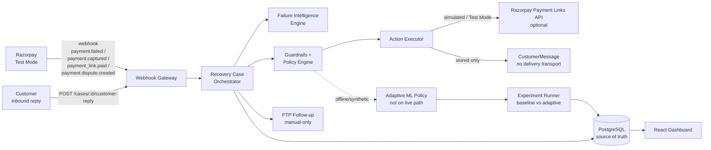
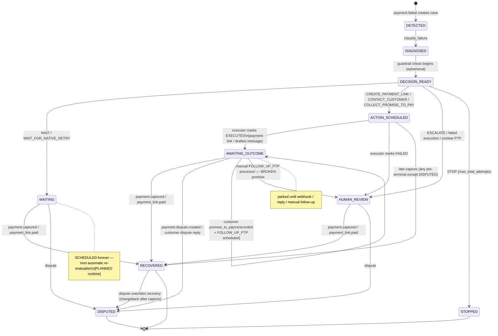
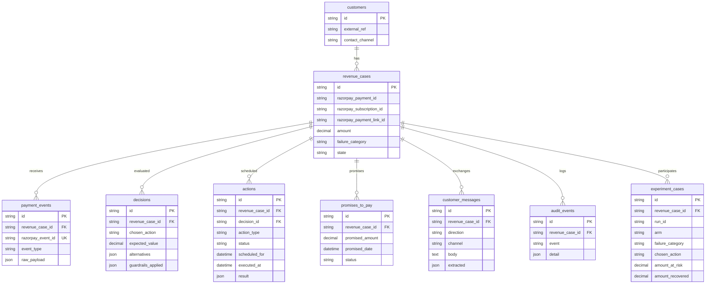

# RecoveryOS — Architecture

> Canonical system design. For "what is done **right now**" see `docs/CURRENT_STATE.md`. States, flows, and contracts here are derived from `backend/app/**` — if this document drifts from code, code wins and this document must be fixed.

## One-line pitch

When a Razorpay payment fails, RecoveryOS decides whether to wait for a native retry, contact the customer, send a payment link, collect a promise-to-pay, escalate — or do nothing — and measures which decisions recover the most money with the least customer friction.

## Product boundary

Razorpay Optimizer already decides **which gateway/route** should process a payment attempt. RecoveryOS starts **after** a payment has already failed or a receivable has gone overdue. It answers: *what should the business do next?* It does not touch routing.

| Capability | Razorpay already has | What RecoveryOS adds |
|------------|----------------------|----------------------|
| Payment / subscription failure events | Yes | Consumes them as recovery signals |
| Automatic subscription retries | Yes | Decides whether to stay silent while a native retry runs (`WAIT_FOR_NATIVE_RETRY`) |
| Payment Links | Yes | Decides *when* creating one is the right move |
| Gateway routing optimization | Yes (Optimizer / Smart Router) | Out of scope |
| Failure metadata (`error_source`/`step`/`reason`) | Yes | Normalizes it into 8 explicit recovery categories |
| Promise-to-pay | Suggested in brief | One action inside a larger decision controller, not the whole product |
| Stopping rules / audit trail | Required by brief | Executable, persisted, downloadable |
| Cross-intervention decisioning (wait vs contact vs link vs PTP vs escalate) | Not a standalone offering | Central policy layer of this project |

---

## System context



---

## Components and status

| Component | Status | Responsibility | Provider calls? |
|-----------|--------|---------------|-----------------|
| Webhook Gateway `app/routers/webhooks.py` | [IMPLEMENTED] | Verify `x-razorpay-signature` on raw bytes, require `x-razorpay-event-id`, dedupe via unique constraint, persist `PaymentEvent` | No |
| Failure Intelligence `app/services/failure_diagnosis.py` | [IMPLEMENTED] | Map (`error_source`,`error_step`,`error_reason`, subscription context) → 8 categories | No |
| Recovery Case Orchestrator `app/services/orchestrator.py` | [IMPLEMENTED] | Owns every `RevenueCase.state` mutation; routes events to diagnosis/policy/recovery/dispute/PTP | No directly — delegates |
| Guardrail Engine `app/services/policy_engine.py` | [IMPLEMENTED] | Enforce `max_contacts_per_case`, `max_contacts_per_7_days`, `min_contact_interval_hours`, `max_automated_amount`, `max_total_attempts` | No |
| Baseline Policy `app/services/policy_engine.py:decide` | [IMPLEMENTED] | Pick highest-ranked allowed action for the category (deterministic) | No |
| Adaptive ML Policy `app/services/ml_policy.py:decide_ml` | [IMPLEMENTED · OFFLINE ONLY] | Score allowed actions by `P(recovery)*amount - cost`; never bypasses guardrails | No — model inference locally |
| Action Executor `app/services/action_executor.py` | [IMPLEMENTED · PARTIAL] | Execute `CREATE_PAYMENT_LINK` / `CONTACT_CUSTOMER` / `COLLECT_PROMISE_TO_PAY`; leave `WAIT`/`ESCALATE`/`STOP` as state only | Yes — Razorpay (Payment Links) and LLM (draft) when enabled |
| Razorpay Client `app/services/razorpay_client.py` | [IMPLEMENTED · SIMULATED / TEST_MODE_ONLY] | `POST /v1/payment_links`; simulation fallback; `rzp_test_*` gate | Yes — Razorpay Test Mode when `RAZORPAY_API_ENABLED=true` |
| LLM Client `app/services/llm_client.py` | [IMPLEMENTED · SIMULATED / PARTIAL] | Draft outbound text; extract PTP intent `{intent, amount, date, confidence}` | Yes — Anthropic Messages API when `LLM_API_ENABLED=true`; **anthropic-only**, other providers raise |
| PTP Extractor `app/services/ptp_extractor.py` | [IMPLEMENTED] | Validate LLM extraction before recording `PromiseToPay` | No |
| PTP Follow-up `app/services/ptp_followup.py` | [PARTIAL · MANUAL_ONLY] | Process due `FOLLOW_UP_PTP` rows → `BROKEN` + `HUMAN_REVIEW` | No |
| Redis / RQ | [PLANNED] | Reserved for future wake-up runtime; currently no queue, worker, or scheduler | No — no imports in `backend/app/**` |
| Experiment Runner `app/services/experiment_runner.py` | [IMPLEMENTED] | Matched-scenario baseline vs adaptive with `run_id` + CSV audit | No |
| Dashboard `frontend/src/**` | [IMPLEMENTED · PARTIAL] | Health, case list, experiment panel; `GET /cases/:id` exists without a rendered view | No |

Money-moving decisions are made by deterministic code (guardrails + policy), never by an LLM.

---

## Event flow

```mermaid
sequenceDiagram
    participant RZP as Razorpay
    participant GW as Webhook Gateway
    participant DB as PostgreSQL
    participant ORCH as Orchestrator
    participant DIAG as Failure Diagnosis
    participant POL as Policy + Guardrails
    participant EXEC as Action Executor

    RZP->>GW: POST /webhooks/razorpay<br/>(event, payload, x-razorpay-signature, x-razorpay-event-id)
    GW->>GW: verify_signature(raw_body, secret)
    GW->>DB: INSERT PaymentEvent (unique event_id)
    alt duplicate event_id
        DB-->>GW: IntegrityError
        GW-->>RZP: 200 {ignored: duplicate_event}
    end
    GW->>ORCH: handle_event(db, event, payload)
    ORCH->>DIAG: classify_failure(entity)
    DIAG-->>ORCH: failure_category
    ORCH->>POL: decide(case) — baseline, inline
    POL->>DB: INSERT Decision + Action (SCHEDULED), set case.state
    ORCH->>EXEC: execute(case, action)
    alt CREATE_PAYMENT_LINK / CONTACT_CUSTOMER / COLLECT_PROMISE_TO_PAY
        EXEC->>DB: EXECUTED + result (+ CustomerMessage when contact)
        EXEC-->>ORCH: case.state → AWAITING_OUTCOME
    else WAIT / WAIT_FOR_NATIVE_RETRY
        Note over EXEC: no side effect; case.state → WAITING<br/>SCHEDULED forever (no worker)
    else ESCALATE / STOP
        Note over EXEC: no side effect; case.state → HUMAN_REVIEW / STOPPED
    end
    ORCH->>DB: COMMIT
    GW-->>RZP: 200 {case_id, case_state}
```

---

## State ownership

- **Only `app/services/orchestrator.py` mutates `RevenueCase.state`.** Policy, executor, and follow-up modules mutate state through the orchestrator or via the executor's narrowly owned transitions (`ACTION_SCHEDULED → AWAITING_OUTCOME / HUMAN_REVIEW`). This invariant is enforced by code review rather than by a type-level guard.

---

## Recovery case state machine — canonical definition

Derived from `app/services/orchestrator.py:46` and `app/services/policy_engine.py:41`.



### State inventory

| State | Terminal? | How entered | In `REPLYABLE_STATES`? | Notes |
|-------|-----------|-------------|------------------------|-------|
| `DETECTED` | No | `_handle_failure` creates `RevenueCase` | No | Immediately diagnosed within same request |
| `DIAGNOSED` | No | `_diagnose` sets `failure_category` + `state=DIAGNOSED` | Yes — but only ephemeral | Immediately passed to `policy_engine.decide` |
| `DECISION_READY` | No | `policy_engine.decide` sets before choosing | Yes | Never persisted long — transitions inline to a final state |
| `WAITING` | Automation-terminal | `WAIT` / `WAIT_FOR_NATIVE_RETRY` | Yes | **No wake-up**; terminal for automation but `payment.captured` can still recover |
| `ACTION_SCHEDULED` | No | `CREATE_PAYMENT_LINK` / `CONTACT_CUSTOMER` before execution | Yes | Immediately executed → `AWAITING_OUTCOME` or `HUMAN_REVIEW` |
| `AWAITING_OUTCOME` | Automation-terminal | Action executed or PTP recorded | Yes | Parked until webhook/reply/manual follow-up |
| `HUMAN_REVIEW` | Automation-terminal | `ESCALATE`, execution failure, PTP validation failure, broken promise | Yes | Requires human; `payment.captured` can still recover but `FOLLOW_UP_PTP` does not auto-fire |
| `RECOVERED` | **Yes** | `_recover_case` (late capture or `payment_link.paid`) | No | Dispute still overrides to `DISPUTED` |
| `STOPPED` | **Yes** | `STOP` (stopping rule) | No | `RECOVERED` still possible via inbound recovery event; dispute can override |
| `DISPUTED` | **Yes** | `_dispute_case` | No | Always wins, even over `RECOVERED` |

### Known deviation between intended and actual transitions

- `REPLYABLE_STATES` (`orchestrator.py:294`) includes `DECISION_READY`. Since `DECISION_READY` is never persisted beyond the current transaction, this branch is effectively dead. Harmless but documented in `docs/CURRENT_STATE.md` debt.
- `WAITING` is entered by two distinct actions (`WAIT` vs `WAIT_FOR_NATIVE_RETRY`) with different intent (generic transient vs subscription-native-retry) but identical current runtime behavior — both are `SCHEDULED` forever.

---

## Database as source of truth



- `payment_events`, `decisions`, `audit_events` are **append-only** — never overwritten. The history is itself the product.
- Migrations own schema (`backend/alembic/versions/*`); `app/models.py` is the source of truth for model shape.
- For the full column list, read `app/models.py:29`.

---

## Policy / guardrail boundary

```
policy_engine.decide(case)                       ml_policy.decide_ml(case)
  │  state must be DIAGNOSED                        │  state must be DIAGNOSED
  ▼                                                 ▼
  max_total_attempts? → STOP                        same stopping rule
  │                                                 │
  candidates = CATEGORY_ACTION_PREFERENCE[cat]      allowed = {a | guardrail allows a}
  │                                                 │
  filter by check_action_allowed                    scorer.rank_actions(context, allowed)
  │  first allowed wins                             │  P(recovery)*amount - cost, ranked
  ▼                                                 ▼
  record_decision → Action(SCHEDULED)               record_decision (same call)
  │  state → ACTION_TO_STATE[action]                │  same ACTION_TO_STATE mapping
```

- Guardrails are applied **identically** for baseline and adaptive — the adaptive scorer never bypasses them. See `app/services/ml_policy.py:35`.
- Guardrail defaults (`policy_engine.py:68`): `max_contacts_per_case=3`, `max_contacts_per_7_days=2`, `min_contact_interval_hours=12`, `max_automated_amount=₹25,000`, `max_total_attempts=5`.

---

## ML boundary

```
ground_truth.py: BASE_PROBABILITY[(category, action)]  ──┐
     true_probability(category, action, amount,           │ modulated by amount,
       days_overdue, previous_contacts, subscription) ◄── │ overdue decay, contact fatigue
                                                          │
  synthetic_history.py: generate_history(n, seed) ◄───────┤ uniform action sampling
                           │                               │
                     train.py: HistGradientBoosting ◄──────┘  CATEGORICAL: failure_category, action_taken
                              (OneHotEncoder + numeric)        NUMERIC: amount, days_overdue, ...
                           │  → artifacts/model.joblib         saves {pipeline, feature_columns}
                           ▼
         scorer.py: rank_actions(context, allowed) — P(recovery)*amount - cost
                           │
                  ml_policy.py: decide_ml — guarded, offline only
                           │
           experiment_runner.py / evaluate_policies.py — common-random-numbers, synthetic outcomes
```

- **Synthetic-only scope:** `ground_truth.py` is the sole source of `P(recovery | category, action)` labels and of evaluation outcomes. Training against the same simulator that evaluates creates **circularity** — see `docs/ML_AND_EVALUATION.md`.
- **Not on the live path:** `orchestrator.py` calls `policy_engine.decide`, never `ml_policy.decide_ml`.
- Cost proxies: `WAIT=0`, `WAIT_FOR_NATIVE_RETRY=0`, `CREATE_PAYMENT_LINK=5`, `CONTACT_CUSTOMER=15`, `COLLECT_PROMISE_TO_PAY=15`, `ESCALATE=50`, `STOP=0` (`app/ml/costs.py:15`). These are not calibrated friction values; recovered value dominates.

---

## LLM boundary

| Concern | Truth |
|---------|-------|
| Provider | **Anthropic only** (`app/services/llm_client.py:32` `ANTHROPIC_MODEL=claude-3-5-haiku-latest`). `LLM_PROVIDER != anthropic` raises `LLMAPIError`. Not provider-agnostic. |
| Enablement | `LLM_API_ENABLED=true` **and** `LLM_API_KEY` must both be set; credentials alone never trigger network. |
| Fallback | Templated drafts (`_TEMPLATES`); regex/keyword PTP extraction (`_simulated_extract`, `DISPUTE_PHRASES`, `AMOUNT_PATTERN`). Both tag `simulated=true` / `channel=simulated`. |
| Allowed responsibilities | Draft one outbound recovery message; classify a single inbound customer reply into `{promise_to_pay, dispute, unclear}` + extract `{amount, date, confidence}`. |
| Prohibited responsibilities | Never decides whether money moves. Extraction is validated by `ptp_extractor.validate_promise` before recording; disputes still route through the same `_dispute_case` path as Razorpay webhooks. |
| Failure mode | `LLMAPIError` → executor marks `Action FAILED` + `HUMAN_REVIEW`; malformed Anthropic JSON → `unclear` with `parse_error` (does not crash pipeline). |

---

## Razorpay integration boundary

- Webhooks: `POST /webhooks/razorpay` verifies `x-razorpay-signature` on raw bytes (`app/core/security.py:11`); requires `x-razorpay-event-id`; deduped via unique DB constraint. Supported inbound events: `payment.failed`, `subscription.halted`, `payment.captured`, `subscription.charged`, `payment_link.paid`, `payment.dispute.created` (`app/services/orchestrator.py:36`).
- Payment Links: `create_payment_link` (`app/services/razorpay_client.py:48`) — **simulated** by default (`plink_sim_*`); live only when `RAZORPAY_API_ENABLED=true` with a `rzp_test_*` key. `rzp_live_*` rejected. Fulfillment is via a *different* `razorpay_payment_id` than the failed payment; matched on `RevenueCase.razorpay_payment_link_id`.
- **What is not implemented:** Subscriptions/Orders API, automatic HMAC key rotation, production live-money flow.

---

## Frontend boundary

- Routes: `GET /health`, `GET /cases`, `GET /cases/{id}`, `POST /cases/{id}/customer-reply`, `POST/GET /experiments`, `GET /experiments/{id}/export.csv` (`app/main.py:12` + `app/routers/*`).
- Dashboard shows: backend health, case list (state / failure category / chosen action), and the persisted experiment runner (side-by-side baseline vs adaptive, incremental ₹, action distribution, CSV audit). `GET /cases/{id}` detail (`decisions`/`actions`/`audit_trail`/`promises_to_pay`/`messages`) exists but is **not rendered** by the current frontend (`frontend/src/App.tsx:113` only lists cases).
- No authentication, no per-merchant routing, no real-time polling/websocket.

---

## External side-effect boundary

| Action type | Side effect | Transport | Delivery guarantee |
|-------------|------------|-----------|--------------------|
| `WAIT`, `WAIT_FOR_NATIVE_RETRY` | None | — | `SCHEDULED` row only |
| `CREATE_PAYMENT_LINK` | Payment Link creation | Razorpay REST API (or simulation) | Executed inline; failure → `HUMAN_REVIEW` |
| `CONTACT_CUSTOMER`, `COLLECT_PROMISE_TO_PAY` | Customer message drafted + stored | None (no SMS/email/WhatsApp) | `EXECUTED` after store; `CustomerMessage.body` persisted |
| `FOLLOW_UP_PTP` | Scheduled follow-up row | None (manual processor) | `SCHEDULED` until `process_due_followups` runs |
| `ESCALATE` | None | — | `SCHEDULED` + `HUMAN_REVIEW` |
| `STOP` | None | — | `SCHEDULED` + `STOPPED` |

---

## Future components

- **Temporal Recovery Runtime (wake-up scheduler) [PLANNED]:** Real delayed-action worker that re-evaluates `WAITING`/`AWAITING_OUTCOME` when their `scheduled_for` arrives, treating PostgreSQL as source of truth and Redis only as transport. Not drawn as implemented.
- **Production Razorpay live-money path [PLANNED]:** Separate credentials, environment gate, and hardened HMAC/secret management.
- **Message delivery transport [PLANNED]:** Actual SMS/email/WhatsApp dispatch for drafted `CONTACT_CUSTOMER` messages.
- **Live adaptive policy [PLANNED]:** Replace the baseline `policy_engine.decide` call in `orchestrator._diagnose` with guarded `ml_policy.decide_ml` behind a feature flag, after real outcome logging validates the model.

---

## Build order

Event pipeline → state machine → guardrails + baseline → real recovery action (Payment Links) → ML policy (offline) → LLM + Promise-to-Pay → measurement dashboard → reliability. Each stage depends on the prior one being trustworthy before the next layer is added. This is historical context for maintainers, not a reopened plan.
